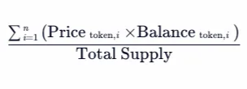

# 经济模型

**本方案设计了一套基于代币的 ETF 方案，**

**一个 ETF 由多种成分代币组成，ETF 的价值变化反映了各成分代币价值变化的趋势。**

**现对经济模型推演如下：**

**假设：铸造一种代币 etf，其中 btc 占 20%，link 占 80%，初次 mint 了 200USDT，100 份，他的铸造和赎回过程，各代币个数及总数关系应满足以下逻辑**

---

### 1. 初始分配

- **总价值**：200 USDT
- **份额**：100 份
- **每份初始价值**：2 USDT
- **BTC 占比**：20%（40 USDT）
  - 初始 BTC 价格：40,000 USDT
  - BTC 数量：`40 USDT / 40,000 USDT = 0.001 BTC`
  - 每份 BTC 数量：`0.001 BTC / 100 = 0.00001 BTC`
- **LINK 占比**：80%（160 USDT）
  - 初始 LINK 价格：20 USDT
  - LINK 数量：`160 USDT / 20 USDT = 8 LINK`
  - 每份 LINK 数量：`8 LINK / 100 = 0.08 LINK`
  所以在 MINT 这 100 份 ETF 时，需要消耗 200USDT 同时 MINT 8LINK 和 0.001BTC

---

### 2. 赎回时的情况

假设赎回时：

- BTC 价格上涨到 45,000 USDT
- LINK 价格上涨到 25 USDT

由于 ETF 的涨价完全是由底层资产价格上涨引起的，**每份 ETF 对应的底层资产数量不变，即各代币的总数/ETF 的总份额**：

- 每份 BTC 数量：`0.00001 BTC`
- 每份 LINK 数量：`0.08 LINK`
- **每份 BTC 价值**：`0.00001 BTC * 45,000 USDT = 0.45 USDT`
- **每份 LINK 价值**：`0.08 LINK * 25 USDT = 2 USDT`
- **每份 ETF 总价值**：`0.45 USDT + 2 USDT = 2.45 USDT`

这些资产的总价值为  **2.45 USDT**，比初始的 2 USDT 上涨了，这是因为底层资产（BTC 和 LINK）的价格上涨了。

---

### 3. 追加的情况

**如果用户追加 300 USDT，考虑到每份 ETF 的当前价值已经涨到了  2.45 USDT，我们需要计算用户可以 Mint 的新份额数量，并更新底层资产（BTC 和 LINK）的分配。**

目前的情况

- **每份 ETF 价值**：2.45 USDT
- **追加资金**：300 USDT
- **当前总份额**：100 份
- **当前总价值**：100 份 \* 2.45 USDT = 245 USDT

计算 Mint 的新份额数量

用户追加 300 USDT，按照当前每份 ETF 的价值（2.45 USDT），可以 Mint 的新份额数量为：

新份额数量=追加资金每份  ETF  价值=300/2.45≈122.448  份

因此，需要额外 MINT 122.448  份 ETF，此时

- **新总份额**：100 份 + 122.448 份 ≈ 222.448 份
- **新总价值**：245 USDT + 300 USDT = 545 USDT

此时各成分代币的追加情况如下：

追加的 300 USDT 需要按照当前底层资产的比例（BTC 占 20%，LINK 占 80%）分配到 BTC 和 LINK 中。

- **追加 BTC 价值**：300 USDT \* 20% = 60 USDT
- **追加 LINK 价值**：300 USDT \* 80% = 240 USDT
- **追加 BTC 数量**：60 USDT / 45,000 USDT ≈ 0.001333 BTC
- **追加 LINK 数量**：240 USDT / 25 USDT = 9.6 LINK
- **BTC 总量**：
  - 初始 BTC 数量：0.001 BTC
  - 追加 BTC 数量：0.001333 BTC
  - 新 BTC 总量：0.001 + 0.001333 ≈ 0.002333 BTC
- **LINK 总量**：
  - 初始 LINK 数量：8 LINK
  - 追加 LINK 数量：9.6 LINK
  - 新 LINK 总量：8 + 9.6 = 17.6 LINK

每份 ETF 对应的底层资产数量依然等于 成分代币总量/ETF 总份额

- **每份 BTC 数量**：
  - 新 BTC 总量：0.002333 BTC
  - 新总份额：222.448 份
  - 每份 BTC 数量：0.002333 BTC / 222.448 ≈ 0.00001049 BTC
- **每份 LINK 数量**：
  - 新 LINK 总量：17.6 LINK
  - 新总份额：222.448 份
  - 每份 LINK 数量：17.6 LINK / 222.448 ≈ 0.0791 LINK

注意，每次 MINT 生成的成分代币数量不一定相同，因为**ETF 的每份价值**是由底层资产的价格决定的，当底层资产价格上涨时，同样的资金能购买的资产数量减少，因此每份 ETF 中的资产数量也会减少，反之，当底层资产价格下跌时，同样的资金能购买的资产数量增加，因此每份 ETF 中的资产数量也会增加。所以：

1. **如果底层资产价格不变**：每份 ETF 中的 BTC 和 LINK 数量与第一次 Mint 时相同。
2. **如果底层资产价格上涨**：每份 ETF 中的 BTC 和 LINK 数量会比第一次 Mint 时少。
3. **如果底层资产价格下跌**：每份 ETF 中的 BTC 和 LINK 数量会比第一次 Mint 时多。

---

### 3. ETF 的净值计算

**ETF 的净值计算**

所以 NAV 的计算逻辑为

（1）遍历成分列表

（2）根据成分列表的 tokenA 地址获取当前 token 的价格

（3）获取 tokenA 在 etf 上的余额

（4）将所有的代币的余额\*价格求和，再除以 etf 的余额，得到当前 etf 的 NAV
